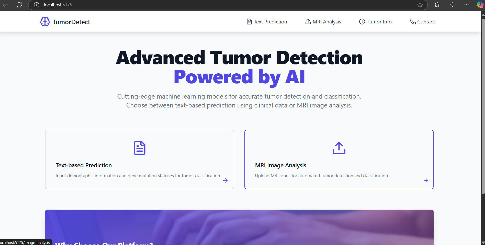

# **Brain Tumor MRI Analysis System**  

A web application that analyzes MRI scans to detect and classify brain tumors, providing AI-driven treatment recommendations.  

## **Features**  

✅ **MRI Scan Analysis** – Upload and analyze brain MRI scans.  
✅ **Tumor Classification** – Detects and classifies three types of brain tumors:  
  - **Glioma**  
  - **Meningioma**  
  - **Pituitary**  
✅ **AI-Powered Recommendations** – Provides treatment insights using **Google Gemini AI**.  
✅ **Confidence Scoring** – Displays model prediction confidence.  
✅ **User-Friendly Interface** – Drag-and-drop upload functionality for easy interaction.  

---

## **Setup Instructions**  

### **1. Clone the Repository**  
```bash
git clone https://github.com/dchaudhari7177/TumerDetect.git
cd TumerDetect
```

### **2. Install Dependencies**  
```bash
npm install
```

### **3. Download the Model File**  
Since GitHub restricts large file uploads, download the trained model (`model_v11.h5`) manually and place it in the project directory.  

📌 **Download Link**: [Google Drive - model_v11.h5](https://drive.google.com/file/d/1RZF6QePVSp8FvdUxNXCl43HhL192aD4q/view?usp=drive_link)  

➡️ **Place the downloaded file in:** `TumerDetect/`  

### **4. Add API Key for Gemini AI**  
Edit the following files and insert your **Google Gemini API key**:  
- `src/pages/ImageAnalysis.tsx`  
- `src/pages/GeminiApi.js`  

### **5. Start the Application**  
```bash
npm run dev
```

### **6. Start the Backend (Flask Server)**  

Run both backend servers as follows:  

#### **Image-Based Recognition (Predict.py - Port 5001)**  
```bash
python predict.py
```

#### **Gene-Based Analysis (App.py - Port 5000)**  
```bash
python app.py
```

---

## **Tech Stack**  

🖥 **Frontend:** React (TypeScript), Tailwind CSS  
🧠 **AI Model:** TensorFlow/Keras (EfficientNetB4)  
⚙ **Backend:** Flask (Python)  
🔍 **Deep Learning Features:** Grad-CAM, Image Segmentation (U-Net), Feature Extraction (ResNet50), Gene Analysis (XGBoost)  

---

## **Machine Learning Models**  

### **Primary Classification Model**  
- **Architecture**: EfficientNetB4 (Transfer Learning)  
- **Dataset**: Brain Tumor MRI Dataset (3,000+ images)  
- **Performance**:  
  - **Training Accuracy:** 98.5%  
  - **Validation Accuracy:** 97.8%  
  - **Test Accuracy:** 97.2%  
  - **F1 Score:** 0.968  

📊 **Class-wise Accuracy**  
✔ Glioma: **98.1%**  
✔ Meningioma: **97.5%**  
✔ Pituitary: **96.8%**  

**Training Details**  
- **Epochs:** 30  
- **Batch Size:** 32  
- **Optimizer:** Adam  
- **Learning Rate:** 0.0001  
- **Cross-Validation:** 5-fold (Avg: **97.4%**)  

### **Supporting Models**  
- **U-Net** – Skull stripping & segmentation  
- **ResNet50** – Feature extraction for **ROI detection**  
- **XGBoost** – Genetic marker-based tumor prediction  

### **Model Capabilities**  
✅ **Multi-class classification** (Glioma, Meningioma, Pituitary, No Tumor)  
✅ **Real-time Image Augmentation**  
✅ **Grad-CAM Visualizations** for interpretability  
✅ **Ensemble Learning** for higher accuracy  

---

## **How to Use**  

1️⃣ **Upload an MRI scan image**  
2️⃣ **Click "Start Analysis"**  
3️⃣ **View Tumor Classification Results**  
4️⃣ **Check AI-Generated Treatment Recommendations**  
5️⃣ **Genetic Marker-based Prediction with Confidence Score**  

## **Images Gallery**
- 
<video width="600" controls>
  <source src="video.mp4" type="TumerDetect\images\screenrecording.mp4">
  Your browser does not support the video tag.
</video>
